# NyamNyam

<p align="center">
  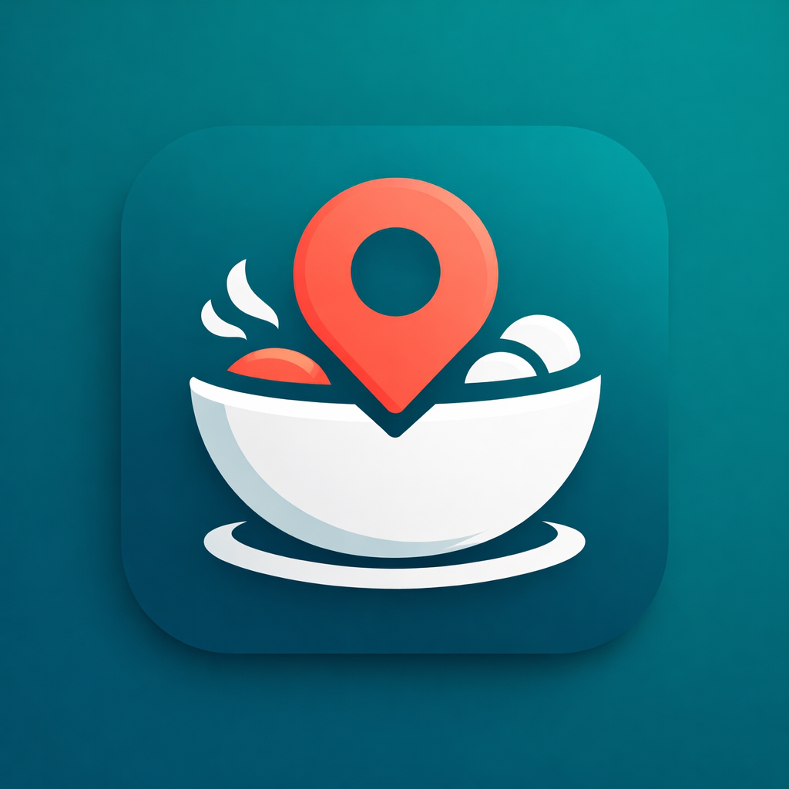
</p>

<p align="center">
  <strong>A modern Flutter restaurant discovery app built as a Dicoding Fundamental Flutter submission and refined as a portfolio-ready mobile project.</strong>
</p>

---

## Overview

`NyamNyam` is a restaurant discovery application that helps users explore places to eat, search restaurants quickly, save favorites, read detailed information, submit reviews, and enable a daily lunch reminder.

The project was originally developed to fulfill the requirements of the **Dicoding Fundamental Flutter** course submission. Beyond the submission goal, the app has been structured and styled as a presentable product that can be showcased to recruiters, interviewers, and collaborators.

## The Problem This App Tries to Solve

Choosing where to eat is often more time-consuming than it should be. Users usually need to:

- browse multiple places manually,
- search for specific restaurants or cuisines,
- remember places they liked before,
- compare ratings and locations,
- and stay inspired when they run out of ideas.

`NyamNyam` addresses that problem by giving users a clean and focused experience for:

- discovering restaurants from a single app,
- checking restaurant details and menus,
- saving favorite restaurants for later,
- and receiving a daily reminder that suggests a restaurant around lunchtime.

## Project Goal

This application was created with two clear goals:

1. **Academic / submission goal**  
   To implement the core competencies required in the Dicoding Fundamental Flutter course, including API integration, state management, local persistence, navigation, testing, notifications, and background processing.

2. **Portfolio / product goal**  
   To turn the coursework into a polished, real-world showcase project that demonstrates practical Flutter engineering skills, UI awareness, and mobile application architecture.

## Main Features

The following features are verified from the current codebase:

- **Restaurant discovery** — fetch and display restaurant data from the Dicoding Restaurant API.
- **Search experience** — search restaurants by keyword in a dedicated search page.
- **Restaurant detail page** — view restaurant information, categories, menus, ratings, and customer reviews.
- **Review submission** — send customer reviews through the app.
- **Favorites** — save and remove favorite restaurants locally.
- **Daily reminder** — schedule a periodic lunchtime reminder using background tasks and local notifications.
- **Theme switching** — switch between system, light, and dark mode.
- **Modern navigation** — bottom navigation with dedicated Home, Search, Favorites, and Settings sections.

## Product Highlights

- Clean Material 3-inspired UI
- Dark mode support
- Lightweight, readable information hierarchy
- Persistent user preferences
- Useful mobile-first interactions for everyday food discovery

## Tech Stack

The stack below is based on the current `pubspec.yaml` and project implementation:

### Core

- **Flutter**
- **Dart**

### Architecture & State Management

- **Provider** — app-wide state management
- **GoRouter** — declarative navigation and nested navigation structure

### Data & Persistence

- **HTTP** — remote API communication
- **Sqflite** — local favorite storage
- **Shared Preferences** — theme and reminder preferences
- **Path** — local database path handling

### UX & Platform Features

- **Google Fonts** — typography
- **Flutter Local Notifications** — local reminder notifications
- **Workmanager** — background task scheduling
- **Timezone** — notification scheduling support

### Quality & Tooling

- **Flutter Test**
- **Integration Test**
- **Mockito**
- **Build Runner**
- **Flutter Launcher Icons**

## Verified Build Snapshot

Current project details verified from the workspace:

- **App name:** `NyamNyam`
- **Version:** `1.0.0+1`
- **Android application ID:** `dev.nyamnyam.nyamnyam`
- **Current generated Android artifact in workspace:** `build/app/outputs/flutter-apk/app-debug.apk`
- **Debug APK size at inspection time:** approximately `66.58 MB`

> Note: the repository is a Flutter multi-platform project structure, but the currently verified generated artifact in the workspace is the Android debug APK.

## User Interface Preview

### Light Mode

<table>
  <tr>
	<td align="center"><strong>Home</strong></td>
	<td align="center"><strong>Search</strong></td>
	<td align="center"><strong>Favorites</strong></td>
  </tr>
  <tr>
	<td>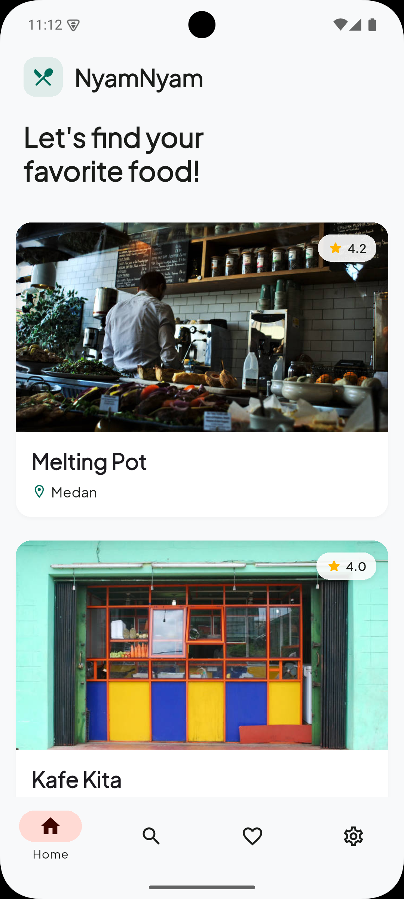</td>
	<td>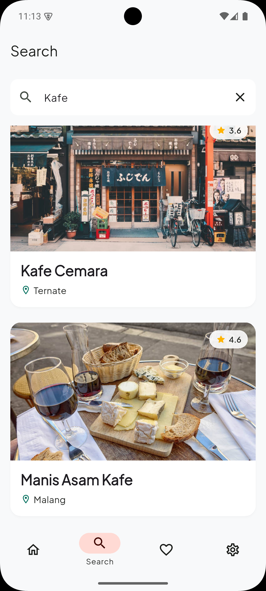</td>
	<td>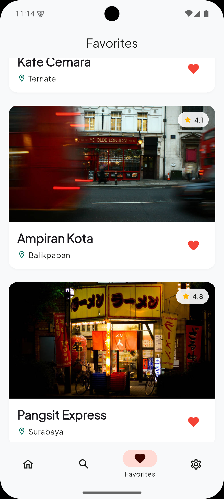</td>
  </tr>
  <tr>
	<td align="center"><strong>Detail</strong></td>
	<td align="center"><strong>Detail (Content)</strong></td>
	<td align="center"><strong>Settings</strong></td>
  </tr>
  <tr>
	<td>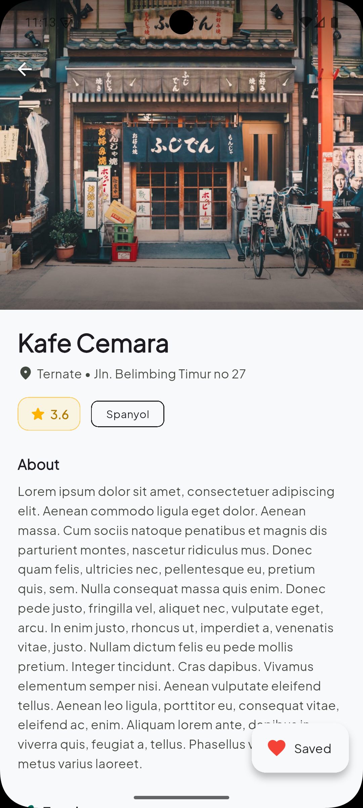</td>
	<td>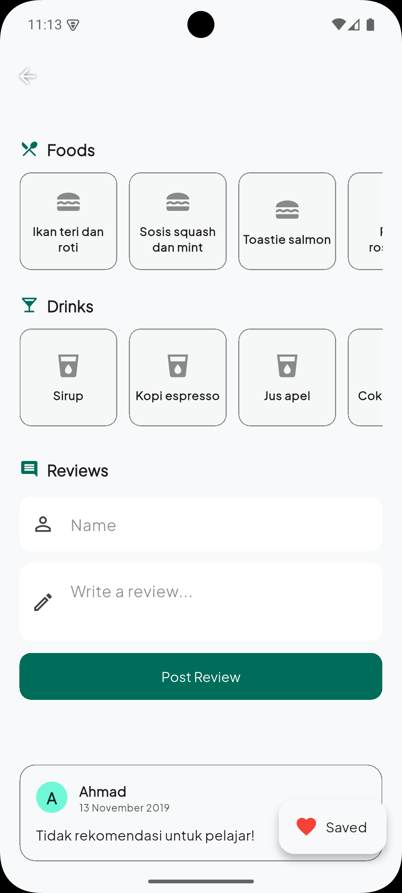</td>
	<td>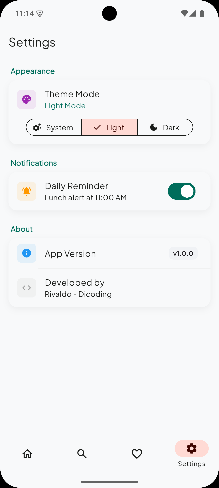</td>
  </tr>
</table>

### Dark Mode

<table>
  <tr>
	<td align="center"><strong>Home</strong></td>
	<td align="center"><strong>Search</strong></td>
	<td align="center"><strong>Favorites</strong></td>
  </tr>
  <tr>
	<td>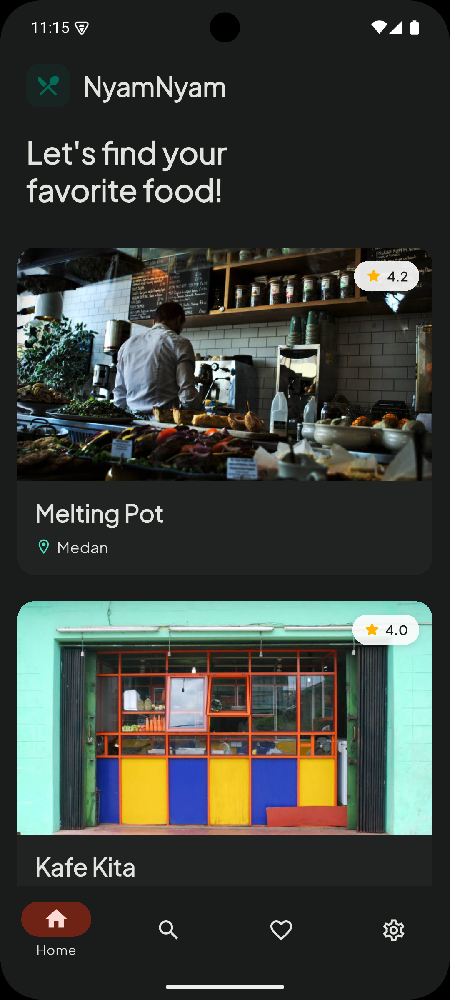</td>
	<td>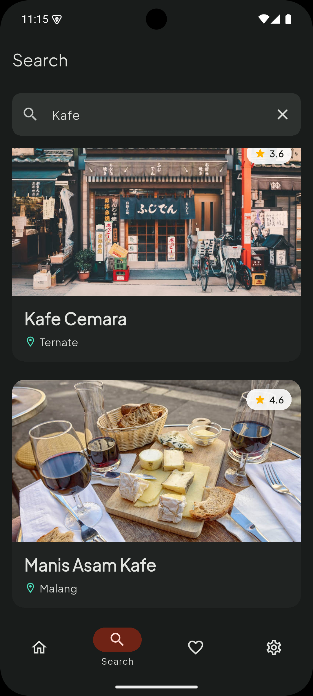</td>
	<td>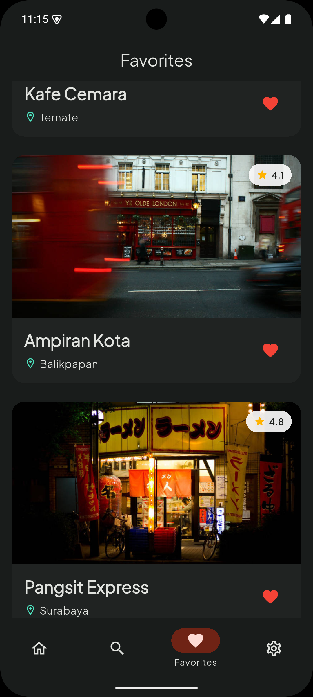</td>
  </tr>
  <tr>
	<td align="center"><strong>Detail</strong></td>
	<td align="center"><strong>Detail (Content)</strong></td>
	<td align="center"><strong>Settings</strong></td>
  </tr>
  <tr>
	<td>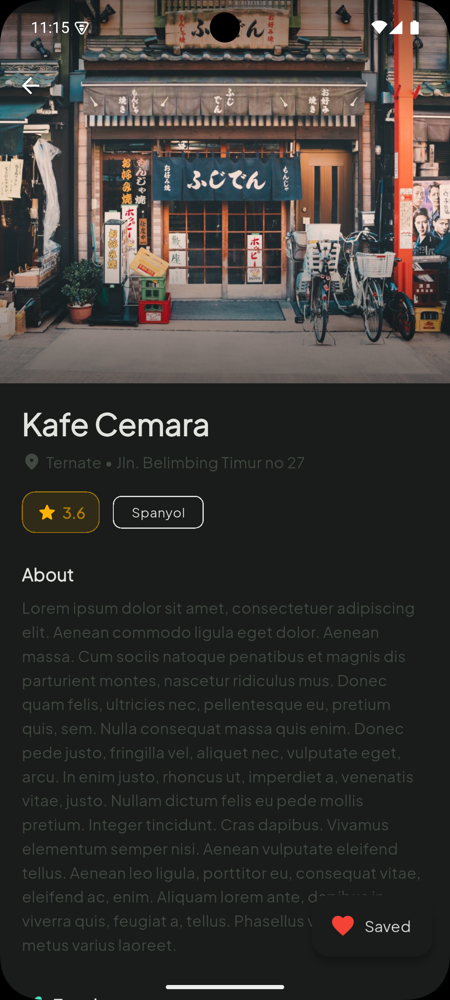</td>
	<td>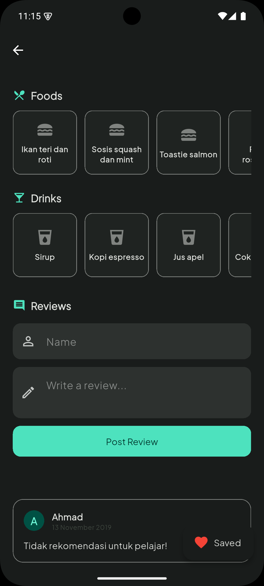</td>
	<td>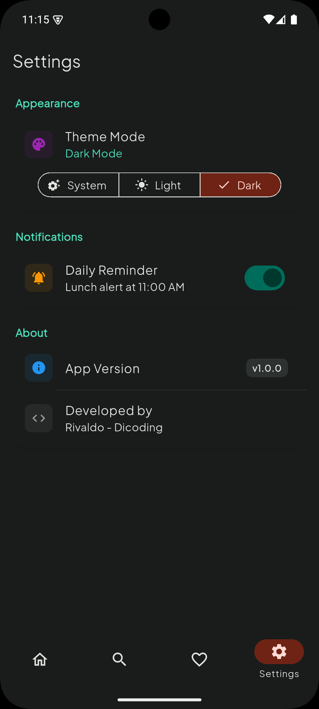</td>
  </tr>
</table>

## Architecture Summary

The app is organized into clear layers to keep responsibilities separated:

- `lib/data/` — API service, models, local storage, and platform services
- `lib/providers/` — state management for lists, detail, search, favorites, reminders, and theming
- `lib/ui/` — pages and reusable UI widgets
- `lib/utils/` — theme, routing, and app-level utilities

This structure makes the project easier to maintain, test, and extend.

## Why This Project Matters in a Portfolio

`NyamNyam` demonstrates practical Flutter skills that are relevant to production mobile development:

- consuming remote APIs,
- handling async state cleanly,
- building responsive user interfaces,
- persisting user data locally,
- integrating notifications and background jobs,
- supporting light and dark themes,
- and packaging the work into a polished application.

For hiring managers and interviewers, this project represents more than a course exercise: it shows how a structured learning project can be elevated into a presentable product case study.

## Getting Started

### Requirements

- Flutter SDK
- Dart SDK
- Android Studio or VS Code / JetBrains IDE with Flutter support
- An emulator, simulator, or physical device

### Run locally

```powershell
flutter pub get
flutter run
```

### Analyze the project

```powershell
flutter analyze
```

### Run tests

```powershell
flutter test
```

## Credits

- Restaurant data source: **Dicoding Restaurant API**
- Built with Flutter as part of the **Dicoding Fundamental Flutter** learning path

---
